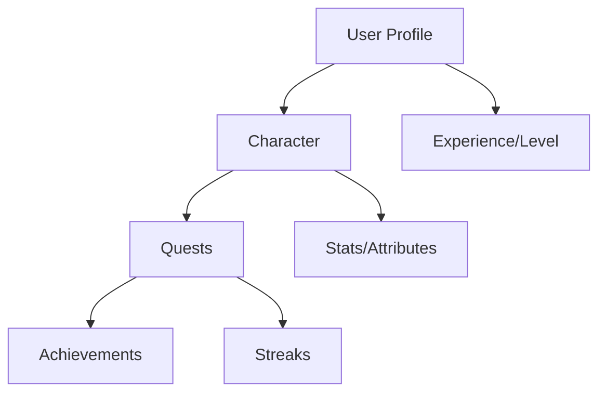

# QuestForge Task RPG

QuestForge transforms ordinary daily tasks into epic quests within a role-playing game framework on the Stacks blockchain. Users create characters, complete tasks to gain experience points and rewards, and progress through achievement levels based on their real-world productivity.

## Overview

QuestForge gamifies task management through:
- Character creation and progression
- Task-based questing system
- Experience points (XP) and leveling
- Achievement tracking
- Recurring quest streaks
- Multiple quest categories (Work, Health, Learning, Social, Creative)

## Architecture

The QuestForge system consists of a single smart contract that manages:



### Core Components
1. **User Profiles**: Track overall progress and registration
2. **Characters**: Manage character attributes and class
3. **Quests**: Handle task creation, completion, and rewards
4. **Achievements**: Track milestones and award bonuses
5. **Streaks**: Monitor recurring quest completion

## Contract Documentation

### Main Data Structures

- `user-profiles`: Stores user registration and progress
- `characters`: Maintains character stats and attributes
- `quests`: Records task details and completion status
- `quest-streaks`: Tracks recurring task completion chains
- `achievements`: Stores unlocked achievements and rewards

### Core Functions

#### User Management
```clarity
(define-public (register-user))
(define-public (create-character (name (string-ascii 30)) 
                                (character-class (string-ascii 20)) 
                                (initial-strength uint) 
                                (initial-intelligence uint) 
                                (initial-dexterity uint)))
```

#### Quest Management
```clarity
(define-public (create-quest (title (string-ascii 50)) 
                            (description (string-utf8 280)) 
                            (quest-type uint) 
                            (difficulty uint)
                            (recurring bool)
                            (recurrence-period uint)))
(define-public (complete-quest (quest-id uint)))
```

## Getting Started

### Prerequisites
- Clarinet installed
- Stacks wallet for deployment

### Basic Usage

1. Register a new user:
```clarity
(contract-call? .quest-forge register-user)
```

2. Create a character:
```clarity
(contract-call? .quest-forge create-character "Hero" "Warrior" u5 u5 u5)
```

3. Create a quest:
```clarity
(contract-call? .quest-forge create-quest "Morning Exercise" "Complete 20 pushups" u2 u2 true u1)
```

4. Complete a quest:
```clarity
(contract-call? .quest-forge complete-quest u1)
```

## Function Reference

### Read-Only Functions
- `get-user-profile`: Retrieve user information
- `get-character`: Get character details
- `get-quest`: Fetch quest information
- `get-streak-info`: Check quest streak status
- `get-achievement`: View achievement details

### Public Functions
- `register-user`: Create new user profile
- `create-character`: Initialize character
- `create-quest`: Create new task
- `complete-quest`: Mark task as done
- `update-quest`: Modify existing task
- `reset-recurring-quest`: Reset recurring task
- `update-character`: Modify character details

## Development

### Testing
1. Clone the repository
2. Install dependencies: `clarinet install`
3. Run tests: `clarinet test`

### Local Development
1. Start REPL: `clarinet console`
2. Deploy contract
3. Interact using provided functions

## Security Considerations

### Limitations
- No admin controls implemented yet
- Simple XP calculation system
- Basic achievement validation

### Best Practices
- Validate all inputs before transactions
- Maintain quest streak windows
- Monitor character stat balance
- Consider gas costs for recurring operations